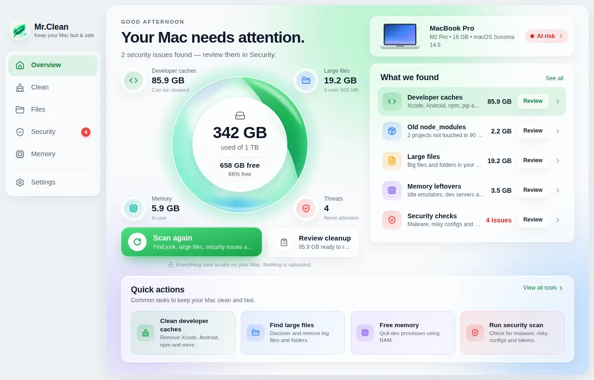
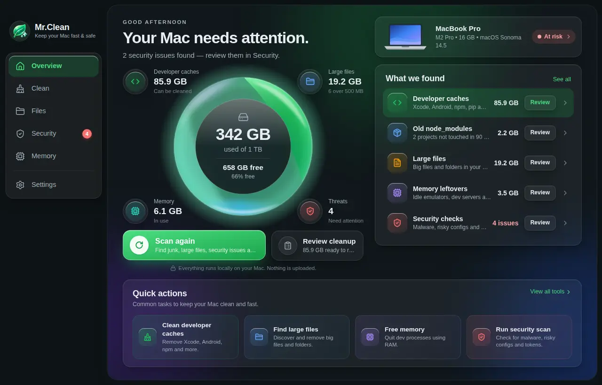
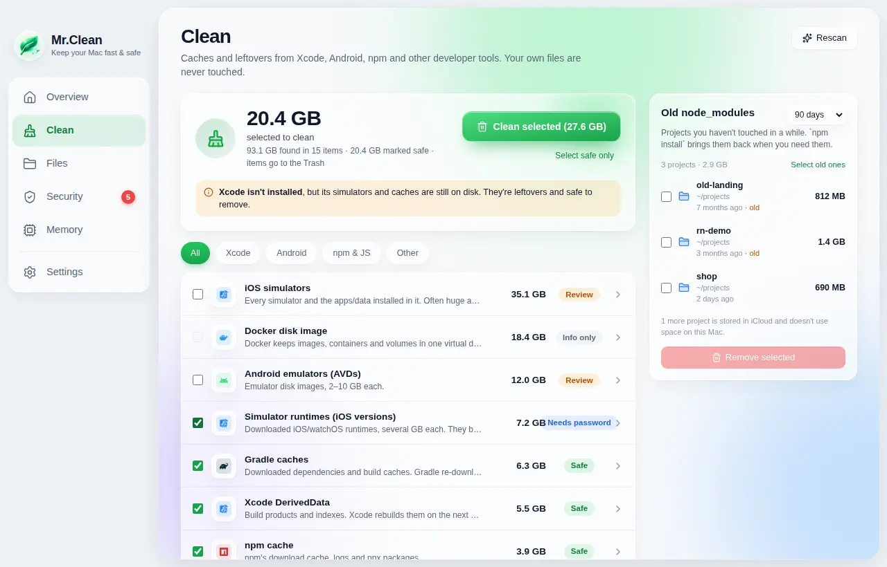
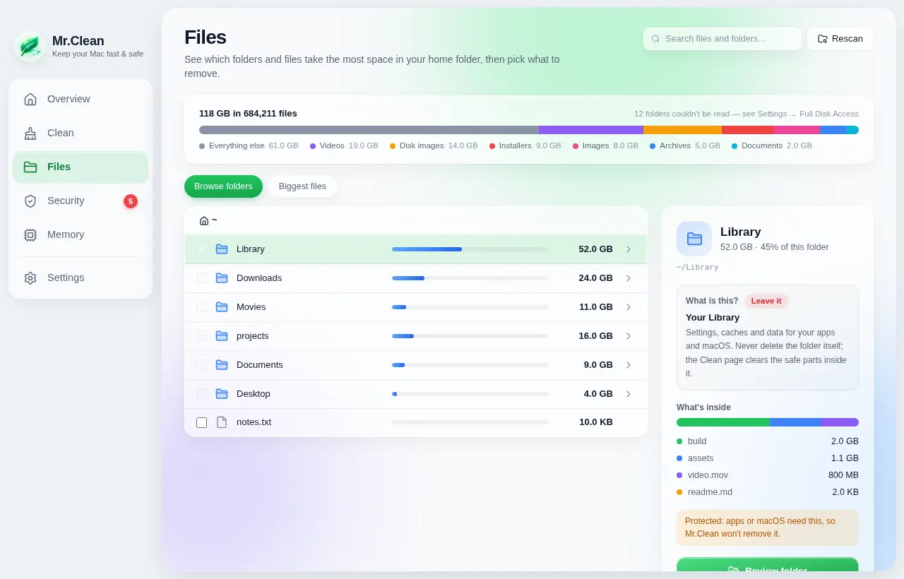
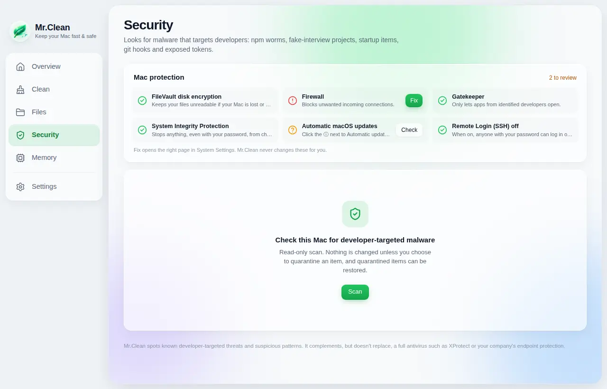
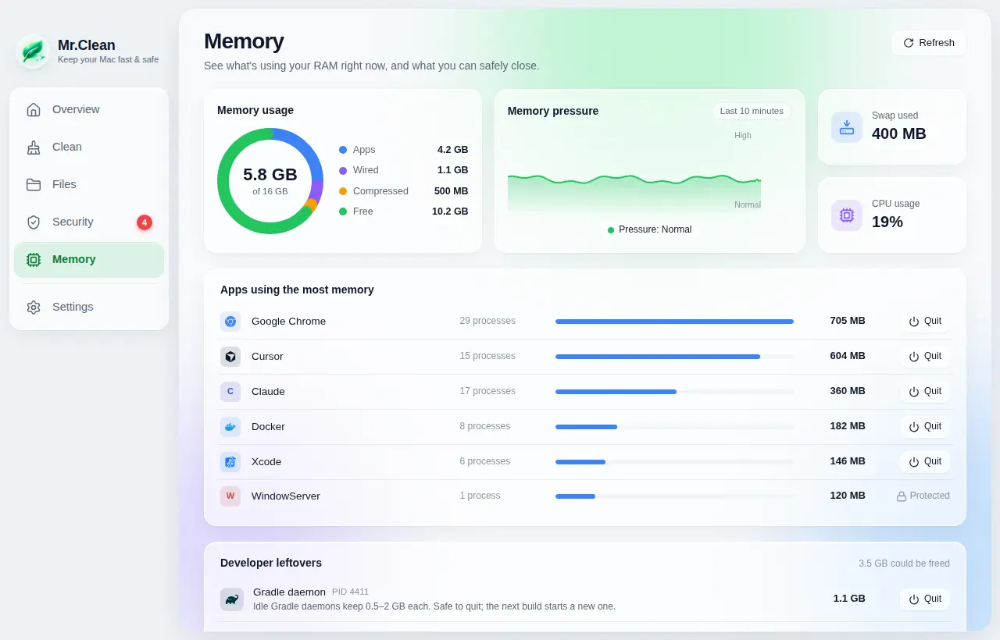
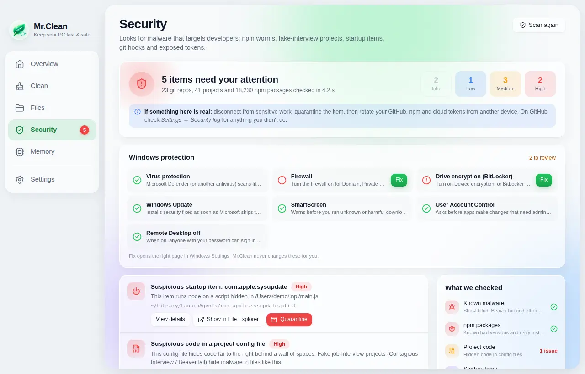

# Mr.Clean

A small desktop app that keeps developer Macs and PCs fast and safe. It cleans out the junk that normal cleaners miss, shows you what's filling your disk, looks for malware that targets developers, and helps you free up RAM.

Built with [Tauri 2](https://tauri.app): a Rust core does all the scanning, and a React UI sits on top. The installer is about 10 MB and the app uses little memory, so it runs well on an 8 GB MacBook. It runs on macOS, Windows 10/11 and Linux (Ubuntu 22.04 or newer).

<p align="center">
  
</p>

**[⬇ Download the latest release](https://github.com/Sahilsalariasoftradix/Mr.Clean/releases/latest)** for macOS, Windows or Linux.

## Features

| Page | What it does |
|---|---|
| **Overview** | Your computer's model, chip, RAM and OS version; a live storage orb; a health headline ("Your Mac, in good shape"); one **Scan everything** button; what the last scan found; and quick actions. |
| **Clean** | Developer caches with filter chips and tool logos: Xcode (DerivedData, device support, **iOS simulators and simulator runtimes**, even after Xcode is uninstalled), Android (Gradle, emulators, system images), npm/yarn/pnpm/bun, CocoaPods, SwiftPM, pip, cargo, Go, .NET/NuGet, Homebrew, VS Code/Cursor, JetBrains/Android Studio, app caches, logs and Windows temp files. Old `node_modules` sit in a side panel (online-only iCloud copies are left out). |
| **Files** | A fast parallel scan of your home folder. Browse folders by size, see the biggest files by type and age, search, and read **"What is this?"** for a folder (for example Apple Intelligence caches, `.gemini`, AppData), with advice on whether deleting is safe. |
| **Security** | Developer-targeted malware: the **Shai-Hulud** npm worm, **Contagious Interview / BeaverTail** fake-job projects, known-bad npm versions, risky install scripts, suspicious startup items (LaunchAgents, cron, systemd, Windows Run keys, Startup folder, scheduled tasks), git hooks that push code, a changed git identity, code in shell or PowerShell profiles, and tokens in plain text. A **protection card** checks FileVault/BitLocker/disk encryption, firewall, Gatekeeper/SmartScreen, updates and remote login, with **Fix** or **How to fix** for each. Some findings have a one-click, confirmed **Fix**. |
| **Memory** | RAM breakdown (apps, wired, compressed, free), a 10-minute pressure chart, apps grouped by memory with their real icons, and developer leftovers (idle Gradle/Kotlin daemons, ADB, emulators, simulators, dev servers, orphaned Node) you can quit safely. |

<details>
<summary>More screenshots</summary>

| | |
|---|---|
|  |  |
|  |  |
|  |  |

</details>

## Safety rules

- **Every delete goes through one guard** (`crates/core/src/safety.rs`) with its own unit tests. The cleaner can only touch folders listed in its catalog. It refuses anything in Documents, Desktop, Downloads, Pictures, iCloud, `.ssh`, keychains, preferences or system folders, and paths are resolved so `..` and symlinks can't escape.
- **Nothing is deleted without confirmation**, and by default items go to the **Trash** (you can change this in Settings).
- Rules are labelled **Safe** (rebuilt automatically, pre-selected), **Review** (emulators, archives, backups; never pre-selected) or **Info only** (e.g. Docker, which needs its own command such as `docker system prune`).
- **The security scanner never deletes anything.** It only reports. You can move a flagged file to quarantine (`~/.mrclean/quarantine`, with execute permission removed) and restore it with one click.
- **Only your own, non-system processes can be quit.** macOS GUI apps get a normal "quit" so they can prompt you to save.
- On Windows the guard also refuses `C:\Windows`, Program Files, ProgramData, saved credentials and app data (except Temp and crash dumps).
- Everything runs on your computer. Nothing is uploaded.

## Install

Get the file for your computer from **[Releases](https://github.com/Sahilsalariasoftradix/Mr.Clean/releases/latest)** (or, for a pull request, from **Actions → Build → Artifacts**).

| Your computer | Download | Size |
|---|---|---|
| Mac (Apple Silicon or Intel) | `Mr.Clean_x.y.z_universal.dmg` | ~8 MB |
| Windows 10/11 | `Mr.Clean_x.y.z_x64-setup.exe` (or `.msi`) | ~5 MB |
| Ubuntu / Debian (22.04+) | `Mr.Clean_x.y.z_amd64.deb` | ~4 MB |
| Any other Linux | `Mr.Clean_x.y.z_amd64.AppImage` | ~75 MB |

Mac and Windows use the web engine built into the system, so their apps are small. On Linux the `.deb` uses the system's WebKitGTK too; the AppImage carries its own copy so it runs on any distro, which is why it's bigger.

**macOS**
1. Open the `.dmg` and drag **Mr.Clean** into **Applications**.
2. The app isn't signed with an Apple Developer ID yet, so the first time macOS says it can't be opened. Click **Done**, then go to **System Settings → Privacy & Security** and click **Open Anyway**.
3. Recommended: grant **Full Disk Access** (Settings page → *Open Privacy settings* → turn on Mr.Clean → restart the app) so every cache folder is visible.

**Windows 10/11**
1. Run the `.exe` installer (or the `.msi`).
2. The installer isn't code-signed yet, so Windows shows "Windows protected your PC". Click **More info → Run anyway**.

**Linux**
- Ubuntu/Debian: `sudo apt install ./Mr.Clean_x.y.z_amd64.deb`
- Any distro: `chmod +x Mr.Clean_x.y.z_amd64.AppImage` and run it.

## Develop

Full setup for macOS, Linux and Windows is in **[CONTRIBUTING.md](CONTRIBUTING.md)**. Quick start:

```bash
npm install
npm run tauri dev          # run the app with hot reload
npm run dev                # UI only, in a browser with sample data (no Rust needed)
cargo test --workspace     # core tests (fake home folders, never your real files)
npm test                   # UI unit tests
npm run test:e2e           # end-to-end tests in Chromium
npm run tauri build        # build an installer for this OS
```

To see what the scanners find on your machine without the UI (read-only):

```bash
cargo run --release -p mrclean-core --example scan -- all   # or: cleaner | files | security | memory
```

Working with Claude Code or another AI assistant? Read **[CLAUDE.md](CLAUDE.md)** first.

### Layout

```
crates/core/          all logic, no UI (unit-tested)
  src/safety.rs       the deletion guard (incl. simulator runtimes, Windows paths)
  src/cleaner/        rule catalog (rules.rs), scan/clean, stale node_modules
  src/bigfiles.rs     folder-size index + biggest files
  src/explain.rs      "What is this folder?" explanations
  src/simruntime.rs   Xcode simulator runtime names and mounts
  src/memory.rs       processes, dev leftovers, safe quit
  src/security/       malware checks, iocs.json, protection.rs (FileVault/BitLocker/…),
                      windows.rs (Run keys, Startup folder, scheduled tasks)
  src/system.rs       device info and dashboard numbers
src-tauri/            Tauri app: thin command wrappers around the core
src/                  React + TypeScript + Tailwind UI (lib/platform.ts: Mac/Windows/Linux wording)
docs/screenshots/     images used in this README
e2e/                  Playwright end-to-end tests (mock backend)
.github/workflows/    ci.yml (tests), security.yml (CodeQL, self-scan, audits), build.yml (.dmg, .deb/.AppImage, .msi/.exe)
```

### Adding a cache location

Add a `rule!(…)` entry in `crates/core/src/cleaner/rules.rs`. Use `Dir` to delete the folder itself or `Contents` to empty it, and mark it `Safe`, `Review` or `ReportOnly`. The tests check that rule IDs are unique and that no rule points into user-data folders.

### Updating malware indicators

`crates/core/src/security/iocs.json` holds the bundled list of compromised packages, malware file names and folders. You can also drop an extra file at `~/.mrclean/iocs.json` on any Mac, in the same format; it's merged in on the next scan, with no rebuild needed.

## Releasing

1. Bump the version in `package.json`, `src-tauri/tauri.conf.json` and `Cargo.toml` (`[workspace.package]`), add a section to [CHANGELOG.md](CHANGELOG.md), and merge.
2. Push a tag like `v0.2.0` from `main`. CI builds the universal `.dmg`, the Linux `.deb`/`.AppImage` and the Windows `.msi`/`.exe`, then one job publishes a GitHub Release with all of them. Windows shows a SmartScreen warning until the installer is signed with a code-signing certificate ([Tauri guide](https://v2.tauri.app/distribute/sign/windows/)). To get rid of the "unidentified developer" warning, add an Apple Developer ID certificate and notarization secrets to the workflow ([Tauri guide](https://v2.tauri.app/distribute/sign/macos/)).

## Contributing & security

Pull requests are welcome. See [CONTRIBUTING.md](CONTRIBUTING.md). Report vulnerabilities privately: [SECURITY.md](SECURITY.md).

## License

GPL-3.0
